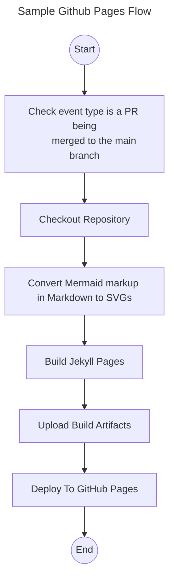

```mermaid
---
title: Sample Github Pages Flow
---
flowchart TD
	Start(("Start"))

	PR["Check event type is a PR being
	merged to the main branch"]

	Check["Checkout Repository"]

	Convert["Convert Mermaid markup in Markdown to SVGs"]

	Build["Build Jekyll Pages"]

	Upload["Upload Build Artifacts"]

	Deploy["Deploy To GitHub Pages"]

	End(("End"))

	Start-->PR
	PR-->Check
	Check-->Convert
	Convert-->Build
	Build-->Upload
	Upload-->Deploy
	Deploy-->End
```
