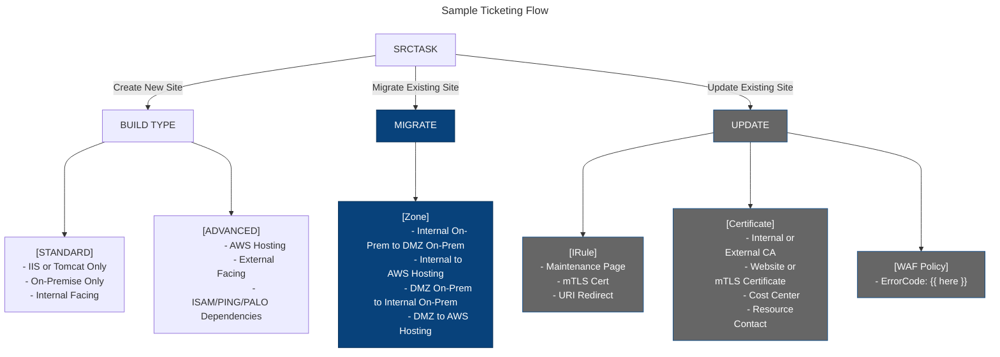

```mermaid
---
title: "Sample Ticketing Flow"
---
flowchart TD
	SRCTASK["SRCTASK"]

	BUILD["BUILD TYPE"]

		STANDARD["[STANDARD]
		  - IIS or Tomcat Only
		  - On-Premise Only
		  - Internal Facing
		"]

		ADVANCED["[ADVANCED]
		  - AWS Hosting
		  - External Facing
		  - ISAM/PING/PALO Dependencies
		"]

	MIGRATE["MIGRATE"]

		ZONE["[Zone]
		  - Internal On-Prem to DMZ On-Prem
		  - Internal to AWS Hosting
		  - DMZ On-Prem to Internal On-Prem
		  - DMZ to AWS Hosting
		"]


	UPDATE["UPDATE"]

		IRULE["[IRule]
		- Maintenance Page
		- mTLS Cert
		- URI Redirect
		"]

		CERT["[Certificate]
		- Internal or External CA
		- Website or mTLS Certificate
		- Cost Center
		- Resource Contact
		"]

		WAF["[WAF Policy]
		- ErrorCode: {{ here }}
		"]

	BUILD--->STANDARD
	BUILD--->ADVANCED

	MIGRATE--->ZONE

	SRCTASK--"Create New Site"-->BUILD
	SRCTASK--"Migrate Existing Site"-->MIGRATE
	SRCTASK--"Update Existing Site"-->UPDATE

	UPDATE--->IRULE
	UPDATE--->CERT
	UPDATE--->WAF

	classDef build fill:#1168bd,stroke:#0b4884,color:#ffffff
	classDef migrate fill:#08427b,stroke:#052e56,color:#ffffff
	classDef update fill:#666,stroke:#0b4884,color:#ffffff

	class Type build
	class MIGRATE,ZONE migrate
	class UPDATE,IRULE,CERT,WAF update

```
